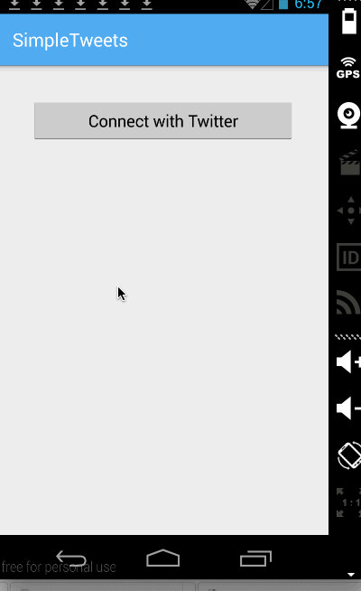
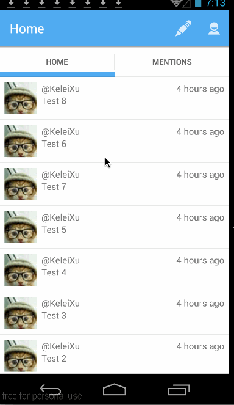

# SimpleTwitter

This is my implementation of the SimpleTwitter that's described here: http://courses.codepath.com/courses/intro_to_android/week/3#!assignment
and here: http://courses.codepath.com/courses/intro_to_android/week/4#!assignment

Time spent: 4 + 5 hours spent in total

Completed user stories:

  * [x] User can sign in to Twitter using OAuth login
  * [x] User can view the tweets from their home timeline
  * [x] User can compose a new tweet

  * [x] User can switch between Timeline and Mention views using tabs.
  * [x] User can navigate to view their own profile
  * [x] User can click on the profile image in any tweet to see another user's profile.
  * [x] User can infinitely paginate any of these timelines (home, mentions, user) by scrolling to the bottom

Extensions:

 * [x] Advanced: User can refresh tweets timeline by pulling down to refresh (i.e pull-to-refresh)
 * [x] Advanced: User can open the twitter app offline and see last loaded tweets

 * [x] Advanced: Improve the user interface and theme the app to feel twitter branded

Walkthrough of all user stories:

GIF created with [LiceCap](http://www.cockos.com/licecap/).

